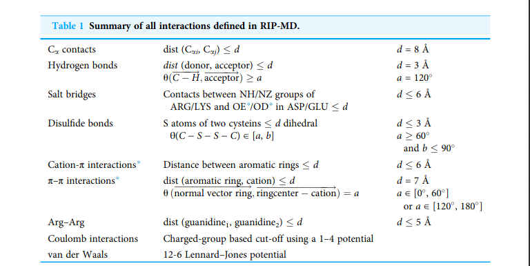

## residue-residue interactions available
|interactions|     Foldx | graphein | RIP-MD | Kamil | interaction type |
|-------|-----------|----------|--------|-------|-----------------------|
|**aromatic**|        | [x]        | [x] | [x]   |                      |
|**hydrogen**| [x]     |     [x]    | [x] | |    | binary
|**hydrophobic**|      |   [x]     | [x]   |  |   |  binary
|**volumetric**|  [x]  |          | | |  |
|**vdW**|              | [x]      | [x] | |  binary |
|**charge**| [x]       |           | [x] | [x] | |
|contact| [x]      |           | [x] | [x] | |
|**disulfide**| [x]    |  [x]       |  [x] | [x] | |
|partcov| [x]      |          | | |
|water| [x]        |           | | |
|distance|      |   [x]         |  [x] | [x] | |
|**cation pi**|      |    [x]        | [x] | [x] | binary |
|**ionic**|      |        [x]    | | |
|**salt bridges**|   |    [x]         | [x] | [x] | |
|stacking pi |    |     [x]         | | |
|delaunay     |    |        [x]     | | |
|**arg - arg**|       |            |  [x] | [x] | binary |
--------------------------------------

* partcov -  Interactions made by protein atoms and metals

## information source
* Foldx print networks:  http://foldxsuite.crg.eu/command/PrintNetworks
* Graphein: https://graphein.ai/modules/graphein.protein.html#edges
* RIP-MD paper
* PLIP https://github.com/pharmai/plip/blob/master/DOCUMENTATION.md
* RING 2.0: https://academic.oup.com/nar/article/44/W1/W367/2499329

## selected criteria
**disulfde**   $$dist(Sulfur, Sulfur) < 2.2 A$$
**hydrophobic** $$dist(\text{any R-group atom}, \text{any R-group atom} ) < 5 A$$ for ALA, VAL, LEU, ILE, MET, PHE, TRP, PRO, TYR
**ionic** $$dist(C_{\alpha i}, C_{\alpha j} ) < 6 A$$  where i,j in  ARG, LYS, HIS, ASP, GLU
**salt bridges** $$dist(NH/NZ, OE/OD)$$ for ARG/LYS and ARG/GLU respectively
**arg-arg** $$dist(\text{guanidine}_i, \text{guanidine}_j) < 5 A$$
**cation $$\pi$$** $$dist(\text{aromatic ring}_i, \text{aromatic ring}_j)$$ i in Trp, Tyr, Phe (His?)

## resources
#### RIP-MD criteria

## remarks
- more then two residues may take part in ionic interactions: https://pubmed.ncbi.nlm.nih.gov/21654080/
- "It has been shown that the influence of each residue over the surrounding medium extends effectively only up to 8 Å" : https://www.sciencedirect.com/science/article/pii/S0079610703000816
